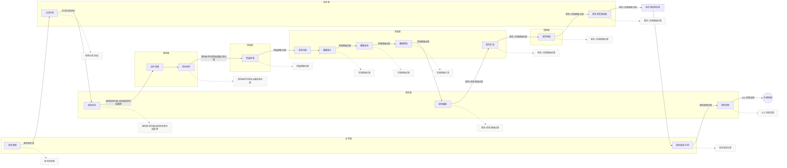

# LIMS第三方检测实验室管理系统 —— 第一阶段正式技术方案

## 1\. 项目概述

### 1\.1 项目定位

本系统为**第三方商业检测实验室专用 LIMS 系统**，用于标准化、无纸化、合规化管理检测全业务流程。严格遵循国内 **CMA、CNAS 实验室质量管理体系**，实现样品委托、合同评审、采样、检测、审核、报告、归档全流程线上化、可追溯、权责可查。

系统定位为**自研轻量化、高合规、可长期迭代**的实验室核心业务系统，不依赖任何老旧开源LIMS框架，完全适配国内检测机构业务规范。

### 1\.2 核心业务流程

本系统严格对标实验室官方标准泳道业务流程，覆盖七大职能部门、全业务节点、流程流转关系及合规输出文档，完整流程如下：

流程核心能力：**逐级审批、节点驳回、原路退回、审批意见留痕、全流程可追溯、全节点合规文档自动生成归档**，完全满足CNAS、CMA质量管理要求。

### 1\.3 部门角色体系

系统内置七大标准实验室业务角色泳道，完全匹配真实实验室组织架构及流程图部门划分：

1. 业务室

2. 技术室

3. 报告室

4. 现场室

5. 样品室

6. 实验室

7. 质控室

---

## 2\. 技术栈最终锁定（第一阶段 100% 确定）

### 2\.1 后端技术栈（纯Go极简架构）

- **开发语言**：Golang 1\.21\+

- **Web框架**：Gin（轻量、高性能、企业级CRUD首选，适配LIMS业务接口开发）

- **ORM框架**：GORM v2

- **数据库**：PostgreSQL 15\+（LIMS最优数据库，支持JSONB动态表单、强事务、复杂查询、审计数据存储）

- **文件对象存储**：MinIO（存储PDF报告、采样照片、扫描附件、原始记录文件、流程输出文档）

- **PDF渲染引擎**：wkhtmltopdf（HTML模板生成CMA报告、各类流程合规记录表单）

- **工作流方案**：**自研状态机**，1:1适配可视化流程图节点与流转规则

- **缓存中间件**：第一阶段**不引入Redis**

- **日志组件**：Zap 结构化日志

- **配置管理**：Viper

### 2\.2 前端技术栈

- **基础框架**：Vue3 \+ Vite（上手简单、热更新快、国内生态完善，适配后台管理系统开发）

- **UI组件库**：Element Plus（企业后台系统标准组件库，表单/表格/弹窗/上传组件齐全，适配LIMS业务页面）

- **状态管理**：Pinia

- **路由管理**：Vue Router

- **动态表单解决方案**：FormMaking 开源拖拽表单设计器（解决LIMS原始记录动态表单痛点，适配多检测项目差异化表单需求）

- **PDF预览**：pdfjs\-dist（前端在线预览报告、各类记录文档）

- **Excel导入导出**：xlsx（支持检测标准、项目数据、业务报表导入导出）

### 2\.3 部署架构

- Docker \+ Docker Compose 容器化部署，环境统一、部署便捷

- Nginx 反向代理、静态资源托管、请求分发

- PostgreSQL、MinIO 容器化统一运维、数据持久化

---

## 3\. 核心架构设计

### 3\.1 系统分层架构

1. **前端展示层**：业务页面、动态表单、审批操作、PDF预览、数据报表、权限控制

2. **API接口层**：Gin路由管理、参数校验、权限拦截、请求响应统一封装

3. **业务逻辑层**：检测业务、流程审批、数据校验、报告生成、文档管理

4. **流程引擎层**：自研状态机（节点流转、部门权限判断、驳回回退、自动生成待办任务）

5. **数据持久层**：GORM \+ PostgreSQL（业务数据、流程数据、审计数据统一存储）

6. **文件存储层**：MinIO对象存储（所有流程输出文档、附件、报告归档存储）

---

## 4\. 自研状态机整体设计

### 4\.1 设计思路

针对本次LIMS**固定串行主流程 \+ 逐级驳回退回 \+ 按部门分配任务**的标准化业务特点，采用**代码配置固化流转规则**，不依赖任何第三方工作流引擎。

所有流程节点、归属部门角色、下一步流转节点、驳回回退节点、节点操作权限，均1:1对标可视化业务流程图配置，完全贴合实验室实际作业规范。

### 4\.2 核心两张流程表（第一阶段核心）

1. **lims\_process\_instance 流程实例表**：记录每一条检测任务的整体流程状态、起止时间、流程完成状态、关联业务ID

2. **lims\_process\_task 流程待办任务表**：记录每一步流程待办、归属部门角色、处理状态、审批意见、处理时间、关联输出文档

业务主表通过 process\_instance\_id 关联流程实例，实现业务数据与流程数据解耦，便于后期迭代扩展。

### 4\.3 状态机能力清单（完全匹配流程图）

- 流程启动后，自动生成首个部门待办任务，匹配流程图初始节点

- 严格按流程图预设部门角色自动分配待办任务，实现泳道权限隔离

- 节点审核通过后，自动流转下一业务节点、生成对应部门新待办任务

- 节点驳回后，自动退回流程图预设上游节点，保留审批记录与操作日志

- 严格权限拦截：非对应部门角色无法操作当前节点，杜绝越权操作

- 全流程审批意见、操作记录、节点状态全程留痕，不可篡改

- 支持流程正常完成、终止、驳回终止等全状态管理

### 4\.4 全流程状态节点（1:1复刻可视化流程图）

任务新增（业务室）→ 合同评审（技术室）→ 质控任务（报告室）→ 采样调度（现场室）→ 现场采样（现场室）→ 样品接收（样品室）→ 任务分配（实验室）→ 数据录入（实验室）→ 数据复核（实验室）→ 数据审核（实验室）→ 报告编制（报告室）→ 报告复核（实验室）→ 报告审核（质控室）→ 报告签发盖章（技术室）→ 报告发放打印（业务室）→ 项目归档（报告室）

每个节点均独立配置：归属部门、可驳回开关、驳回回退目标节点、对应输出合规文档，完全对齐业务流程图规范。

---

## 5\. 系统核心模块设计（第一阶段MVP全覆盖）

### 5\.1 基础权限模块

- 用户管理、部门管理、角色管理，适配七大业务泳道架构

- RBAC权限体系、按钮级权限、数据级权限精准控制

- 登录认证、会话管理、密码安全管理

### 5\.2 基础数据模块

- 检测项目库、检测标准库维护与导入导出

- 仪器设备台账、校准记录管理（适配现场采样设备校准记录需求）

- 物资基础信息管理

### 5\.3 核心业务流程模块（重中之重）

完整实现可视化流程图所有业务节点及合规输出文档，全覆盖实验室作业流程：

- 任务委托新增、委托任务单生成（业务室）

- 合同评审、检测合同/协议归档（技术室）

- 质控方案配置、检测任务质控绑定（报告室）

- 采样调度、现场采样作业、采样记录及设备校准记录归档（现场室）

- 样品接收登记、样品接收记录生成归档（样品室）

- 实验任务分配、数据录入、多级复核审核、实验原始记录留存（实验室）

- 报告编制、报告多级审核、签发盖章、报告审核签发单生成（报告室/质控室/技术室）

- 报告发放打印、报告发放记录归档、项目全资料归档（业务室/报告室）

### 5\.4 原始记录管理模块

- 基于FormMaking实现**自定义动态原始记录表单**，适配不同检测项目差异化录入需求

- 表单数据录入、修改、自动审计留痕

- 原始记录自动生成PDF、批量导出、永久归档

### 5\.5 报告管理模块

- HTML可视化CMA报告模板配置、自定义维护

- 基于业务数据自动渲染生成标准检测报告PDF

- 适配流程图多级审核流程，报告逐级复核、审核、签发

- 报告版本管理、修改留痕、归档溯源

### 5\.6 CNAS审计追踪模块（合规核心）

基于GORM全局钩子，全自动捕获系统所有业务数据、流程数据变更，无需手动编码：

- 自动记录操作人、操作时间、操作类型

- 精准留存修改前、修改后完整数据内容

- 审计日志永久存储、不可删除、不可篡改，满足CNAS外审要求

### 5\.7 文件归档模块

集中收纳流程图全节点输出文档：委托任务单、检测合同、质控方案、采样记录、样品接收记录、实验原始记录、检测报告、签发单、发放记录等，统一存入MinIO对象存储，按检测项目维度归档，支持在线预览、下载、溯源、查验。

---

## 6\. 数据库设计原则（第一阶段）

- 核心业务主体、流程主体使用物理字段，保证查询性能、数据规范性及关联一致性

- 动态表单、检测扩展字段、非结构化业务数据使用 PostgreSQL**JSONB** 存储，灵活适配多项目差异化需求

- 所有流程输出文档、附件、扫描件不存入数据库，仅存储MinIO访问路径，减轻数据库压力

- 独立审计日志表，统一存储全局数据变更记录，合规隔离

- 自研两张专属流程表，统一管控全系统审批流转数据，结构简洁、可控性强

---