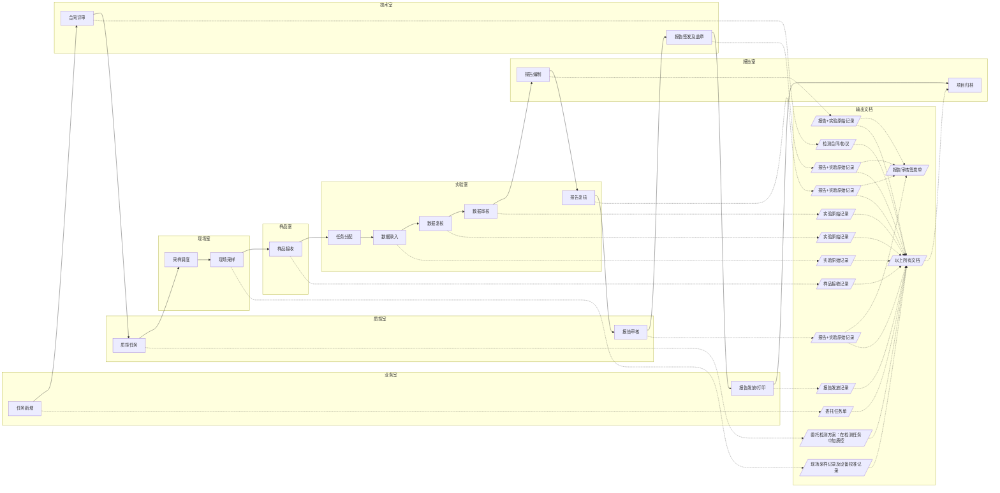

# 业务流程图

```mermaid
flowchart LR
    
    %% 泳道定义
    subgraph 业务室
        direction TB
        B1[任务新增]
        B2[报告发放/打印]
    end
    subgraph 现场室
        direction TB
        S1[采样调度]
        S2[现场采样]
    end
    subgraph 样品室
        direction TB
        P1[样品接收]
    end
    subgraph 实验室
        direction TB
        L1[任务分配]
        L2[数据录入]
        L3[数据复核]
        L4[数据审核]
        L5[报告复核]
    end
    subgraph 报告室
        direction TB
        R1[报告编制]
        R2[项目归档]
    end
    subgraph 质控室
        direction TB
        Q1[质控任务]
        Q2[报告审核]
    end
    subgraph 技术室
        direction TB
        T1[合同评审]
        T2[报告签发及盖章]
    end

    %% 右侧输出文档
    subgraph 输出文档
        direction TB
        D1[/"委托任务单"/]
        D2[/"检测合同/协议"/]
        D3[/"委托检测方案：在检测任务中加质控"/]
        D4[/"现场采样记录及设备校准记录"/]
        D5[/"样品接收记录"/]
        D6[/"实验原始记录"/]
        D7[/"实验原始记录"/]
        D8[/"实验原始记录"/]
        D9[/"报告+实验原始记录"/]
        D10[/"报告+实验原始记录"/]
        D11[/"报告+实验原始记录"/]
        D12[/"报告+实验原始记录"/]
        D13[/"报告发放记录"/]
        D14[/"以上所有文档"/]
        D15[/"报告审核签发单"/]:::reportDoc
    end

    %% 主流程（实线）
    B1 --> T1
    T1 --> Q1
    Q1 --> S1
    S1 --> S2
    S2 --> P1
    P1 --> L1
    L1 --> L2
    L2 --> L3
    L3 --> L4
    L4 --> R1
    R1 --> L5
    L5 --> Q2
    Q2 --> T2
    T2 --> B2
    B2 --> R2

    %% 文档输出虚线连接
    B1 -.-> D1
    T1 -.-> D2
    Q1 -.-> D3
    S2 -.-> D4
    P1 -.-> D5
    L2 -.-> D6
    L3 -.-> D7
    L4 -.-> D8
    R1 -.-> D9
    L5 -.-> D10
    Q2 -.-> D11
    T2 -.-> D12
    B2 -.-> D13
    D14 -.-> R2

    %% 汇聚到“报告审核签发单”的虚线
    D9 -.-> D15
    D10 -.-> D15
    D11 -.-> D15
    D12 -.-> D15

    %% 汇聚到“以上所有文档”的虚线
    D1 -.-> D14
    D2 -.-> D14
    D3 -.-> D14
    D4 -.-> D14
    D5 -.-> D14
    D6 -.-> D14
    D7 -.-> D14
    D8 -.-> D14
    D9 -.-> D14
    D10 -.-> D14
    D11 -.-> D14
    D12 -.-> D14
    D13 -.-> D14
```